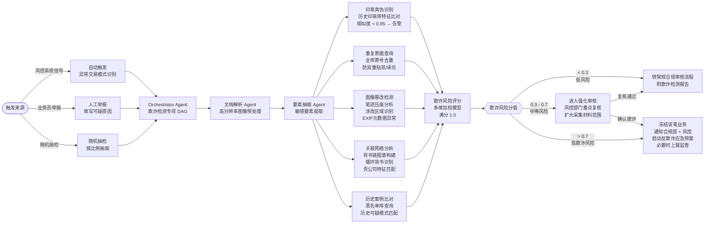

# 票据业务多智能体校验全流程图

> 文档版本：v1.2  
> 覆盖场景：单笔审核 · 批量托收预审 · 欺诈检测 · 跨行流转监控 · 培训辅助  
> 覆盖业务：出票预检 · 提示承兑 · 贴现申请 · 背书转让 · 提示付款 · 质押背书 · 撤销申请 · 托收委托

---

## 一、主流程总览图（所有场景入口）

```mermaid
flowchart TD
    %% ================================================================
    %% 入口路由层（三条独立通道）
    %% ================================================================
    subgraph ENTRY ["入口层 — 三条并行通道"]
        direction LR
        CH_SINGLE["单笔业务通道\n业务员手动发起"]
        CH_BATCH["批量处理通道\n系统定时 / 文件批量导入"]
        CH_FRAUD["欺诈检测通道\n风控信号 / 人工举报 / 随机抽检"]
    end

    %% ================================================================
    %% Orchestrator
    %% ================================================================
    CH_SINGLE --> ORCH
    CH_BATCH  --> ORCH
    CH_FRAUD  --> ORCH_FRAUD["Orchestrator Agent\n欺诈检测专项 DAG"]

    ORCH["Orchestrator Agent\n任务编排 · 类型识别 · DAG 规划 · 优先级调度"]

    %% ================================================================
    %% 单笔通道 — 业务类型路由
    %% ================================================================
    ORCH --> BIZ_TYPE{{"业务类型路由"}}

    BIZ_TYPE -->|出票合规预检|  TAG_IS
    BIZ_TYPE -->|提示承兑|      TAG_A
    BIZ_TYPE -->|贴现申请|      TAG_D
    BIZ_TYPE -->|背书转让|      TAG_E
    BIZ_TYPE -->|提示付款|      TAG_P
    BIZ_TYPE -->|质押背书|      TAG_PL
    BIZ_TYPE -->|撤销申请|      TAG_RV
    BIZ_TYPE -->|托收委托|      TAG_CO

    TAG_IS["出票合规预检\n校验链"]
    TAG_A["提示承兑\n校验链"]
    TAG_D["贴现申请\n校验链"]
    TAG_E["背书转让\n校验链"]
    TAG_P["提示付款\n校验链"]
    TAG_PL["质押背书\n校验链"]
    TAG_RV["撤销申请\n校验链"]
    TAG_CO["托收委托\n校验链"]

    %% ================================================================
    %% STEP 1 · 文档解析（所有单笔业务共用）
    %% ================================================================
    TAG_IS & TAG_A & TAG_D & TAG_E & TAG_P & TAG_PL & TAG_RV & TAG_CO --> PARSE_IN

    subgraph SG_PARSE ["STEP 1 · 文档解析 Agent — 所有业务共用"]
        direction LR
        PARSE_IN(["入口"]) --> OCR["OCR 识别\n正面 · 背面 · 附件"]
        OCR --> LAYOUT["版面分析\n票面 / 背书 / 印章区切分"]
        LAYOUT --> CONF{"置信度 ≥ 0.85?"}
    end

    CONF -->|"< 0.85 不达标"| MAN_DOC(["退回: 图像质量不足\n提示重新上传清晰影像"])
    CONF -->|"通过"| ELEM_IN

    %% ================================================================
    %% STEP 2 · 要素抽取（所有单笔业务共用）
    %% ================================================================
    subgraph SG_ELEM ["STEP 2 · 要素抽取 Agent — 所有业务共用"]
        direction LR
        ELEM_IN(["入口"]) --> LLM_EXT["Qwen2.5-14B 结构化提取\n票面 18项 + 合同 12项要素"]
        LLM_EXT --> AMT_CHK["大小写金额交叉校验\n合同金额 vs 票面金额 ±5%"]
        AMT_CHK --> ELEM_CHK{"必填要素完整?"}
    end

    ELEM_CHK -->|"缺失"| RET_ELEM(["退回: 缺失要素清单\n标注每项法定填写规范"])
    ELEM_CHK -->|"完整"| BRANCH_GATE

    %% ================================================================
    %% STEP 3 · 业务专项 Agent 组合（按类型动态路由）
    %% ================================================================
    BRANCH_GATE{{"按业务类型路由\n到对应 Agent 组合"}}

    %% 各业务类型的Agent组合并行触发
    BRANCH_GATE -->|出票合规预检| IS_C & IS_EXT
    BRANCH_GATE -->|提示承兑|    ACC_C & ACC_EN & ACC_CT
    BRANCH_GATE -->|贴现申请|    DIS_C & DIS_EN & DIS_CT
    BRANCH_GATE -->|背书转让|    END_C & END_EN
    BRANCH_GATE -->|提示付款|    PAY_C & PAY_EN
    BRANCH_GATE -->|质押背书|    PLG_C & PLG_EN & PLG_EXT
    BRANCH_GATE -->|撤销申请|    RV_C & RV_EN
    BRANCH_GATE -->|托收委托|    CO_C & CO_EN

    %% ---- 出票合规预检 ----
    subgraph SG_IS ["STEP 3-IS · 出票合规预检（两路并行）"]
        direction TB
        IS_C["合规检索 Agent\n出票人主体资格 · 出票格式要求\n《票据法》第8-19条 · 出票金额上限核查"]
        IS_EXT["外部接口查询\n出票人征信状态 · 营业执照有效性\n银行授信额度核查（行内系统）"]
    end

    %% ---- 提示承兑 ----
    subgraph SG_ACC ["STEP 3-A · 提示承兑（三路并行）"]
        direction TB
        ACC_C["合规检索 Agent\n承兑期限 · 银票/商票规则\n《票据法》第38-49条"]
        ACC_EN["背书链路 Agent\n持票人合规 · 背书连续性\n'不得转让'标记检测"]
        ACC_CT["合同审核 Agent\n贸易背景真实性\n合同金额↔票面匹配"]
    end

    %% ---- 贴现申请 ----
    subgraph SG_DIS ["STEP 3-D · 贴现申请（三路并行）"]
        direction TB
        DIS_C["合规检索 Agent\n贴现资格 · 持票人须为直接前手\n贴现日距到期日 ≥ 7天"]
        DIS_EN["背书链路 Agent\n背书链末端=贴现申请人\n背书链无断裂"]
        DIS_CT["合同审核 Agent\n贸易背景+增值税发票双验\n防虚假贸易贴现"]
    end

    %% ---- 背书转让 ----
    subgraph SG_END ["STEP 3-E · 背书转让（两路并行）"]
        direction TB
        END_C["合规检索 Agent\n可转让性核查\n'不得转让'字样扫描\n被背书人主体资质"]
        END_EN["背书链路 Agent\n背书人=当前持票人\n日期在票据有效期内"]
    end

    %% ---- 提示付款 ----
    subgraph SG_PAY ["STEP 3-P · 提示付款（两路并行）"]
        direction TB
        PAY_C["合规检索 Agent\n提示付款期限合规\n付款地核查 · 到期日前后10日"]
        PAY_EN["背书链路 Agent\n最终持票人身份确认\n委托收款背书核查"]
    end

    %% ---- 质押背书 ----
    subgraph SG_PLG ["STEP 3-PL · 质押背书（三路并行）"]
        direction TB
        PLG_C["合规检索 Agent\n'质押'字样格式规范\n质押后禁止再转让规则"]
        PLG_EN["背书链路 Agent\n质押人=当前持票人\n质押背书节点合规"]
        PLG_EXT["外部接口查询\n人行票据质押登记系统\n实时核查质押登记状态（同步必查）"]
    end

    %% ---- 撤销申请 ----
    subgraph SG_RV ["STEP 3-RV · 撤销申请（两路并行）"]
        direction TB
        RV_C["合规检索 Agent\n撤销时限合规\n对手行是否已处理\n撤销条件核查"]
        RV_EN["背书链路 Agent\n申请方为当前有效持票人\n无后续背书已发生"]
    end

    %% ---- 托收委托 ----
    subgraph SG_CO ["STEP 3-CO · 托收委托（两路并行）"]
        direction TB
        CO_C["合规检索 Agent\n托收期限合规\n委托收款背书格式\n托收银行资质"]
        CO_EN["背书链路 Agent\n委托背书格式\n委托人为当前持票人\n托收背书后不可再转让"]
    end

    %% ================================================================
    %% STEP 4 · 风险评估（所有路径汇聚）
    %% ================================================================
    IS_C & IS_EXT --> RISK_IN
    ACC_C & ACC_EN & ACC_CT --> RISK_IN
    DIS_C & DIS_EN & DIS_CT --> RISK_IN
    END_C & END_EN --> RISK_IN
    PAY_C & PAY_EN --> RISK_IN
    PLG_C & PLG_EN & PLG_EXT --> RISK_IN
    RV_C & RV_EN --> RISK_IN
    CO_C & CO_EN --> RISK_IN

    subgraph SG_RISK ["STEP 4 · 风险评估 Agent — 四维综合评分"]
        direction LR
        RISK_IN(["汇聚入口"]) --> AGG["聚合全部 Agent 输出\nPASS/WARNING/FAIL 统计"]
        AGG --> SCORE["四维风险评分\n票据本体 · 合规 · 背书 · 合同"]
        SCORE --> RISK_LVL{{"风险等级"}}
    end

    RISK_LVL -->|"绿色 低风险"| AUTO_PASS["系统自动通过"]
    RISK_LVL -->|"黄色 中风险"| MAN_REV["业务主管人工复核"]
    RISK_LVL -->|"橙色 高风险"| WIND_REV["风控部门审核"]
    RISK_LVL -->|"红色 极高风险"| BLOCKED(["拦截 · 合规部介入\n生成风险报告"])

    MAN_REV  -->|"通过"| AUTO_PASS
    MAN_REV  -->|"拒绝"| BLOCKED
    WIND_REV -->|"通过"| AUTO_PASS
    WIND_REV -->|"拒绝"| BLOCKED

    %% ================================================================
    %% STEP 5 · 报告生成
    %% ================================================================
    subgraph SG_RPT ["STEP 5 · 报告生成 Agent"]
        direction LR
        AUTO_PASS --> RPT_GEN["结构化审核报告\n校验结论 · 风险点 · 法规引用"]
        RPT_GEN --> RPT_FMT["JSON + PDF 双格式\n审计日志写入"]
    end

    %% ================================================================
    %% STEP 6 · 报文流转（前置机 → 票交所 → 对手行）
    %% ================================================================
    RPT_FMT --> FRONT["行内前置机\n报文组装 · 数字签名"]
    FRONT   -->|"① 请求报文 + ② 签收回执"| ECDS["票交所 ECDS"]
    ECDS    -->|"③ 转发请求 + ④ 接收回执"| COUNTER["对手行前置机"]
    COUNTER -->|"⑤ 应答报文 + ⑥ 回执确认"| ECDS
    ECDS    -->|"⑦ 转发结果至发起行"| FRONT

    FRONT --> BIZ_RESULT{{"最终结果"}}
    BIZ_RESULT -->|"成功"| SUCCESS(["业务完成 · 结果入账"])
    BIZ_RESULT -->|"对手行拒绝"| FAIL(["生成拒绝报告\n错误码业务语言解释\n处置建议"])
    FAIL -->|"修正后重新发起"| CH_SINGLE

    %% ================================================================
    %% STEP 7 · 流转状态查询 Agent（全程异步监控）
    %% ================================================================
    subgraph SG_TRACK ["STEP 7 · 流转状态查询 Agent — 全程异步监控"]
        direction LR
        TRK_PULL["并发拉取各节点状态\n前置机/票交所/对手行"]
        TRK_TL["重建报文时间轴\n14个消息节点"]
        TRK_ALERT{"超时预警\n检测"}
        TRK_NL["LLM 自然语言摘要\n卡点 · 剩余时限 · 建议"]
        TRK_PULL --> TRK_TL --> TRK_ALERT
        TRK_ALERT -->|"≥70% 剩余时限"| PUSH_ALT["推送告警\n企微/短信/系统弹窗"]
        TRK_ALERT -->|"正常"| TRK_NL
        PUSH_ALT --> TRK_NL
    end

    FRONT & ECDS & COUNTER -.->|"异步状态上报"| SG_TRACK
    SG_TRACK -.->|"实时进度查询"| OFFICER(["业务员 / 运营大盘"])

    %% ================================================================
    %% 批量处理通道（独立路径）
    %% ================================================================
    subgraph SG_BATCH ["批量处理通道 · 批量调度 Agent"]
        direction TB
        BAT_IN["批量任务入队\nCelery + Redis 优先级队列"]
        BAT_SPLIT["任务拆解\n单票独立子任务封装"]
        BAT_POOL["并发处理池\n默认 100 并发，资源隔离"]
        BAT_MERGE["结果汇总\n批量审核报告 · 成功/失败统计"]
        BAT_REPORT["输出批量报告\n逐票明细 + 汇总统计"]
        BAT_IN --> BAT_SPLIT --> BAT_POOL --> BAT_MERGE --> BAT_REPORT
    end

    CH_BATCH --> SG_BATCH
    BAT_POOL -.->|"每个子任务走单笔流程"| SG_PARSE

    %% ================================================================
    %% 欺诈检测通道（独立路径）
    %% ================================================================
    subgraph SG_FRAUD ["欺诈检测通道 · 欺诈检测 Agent（深度专项分析）"]
        direction TB
        FD_TRIGGER["触发来源\n风控信号 / 人工举报 / 随机抽检"]
        FD_SEAL["印章真伪识别\n与历史印章库特征比对"]
        FD_DUP["重复票据查询\n票据号码全库去重\n防双重贴现/承兑"]
        FD_IMG["图像篡改检测\n笔迹压痕分析 · 涂改区域识别\n元数据异常检测"]
        FD_NET["关联网络分析\n背书链关联方图谱\n循环背书 · 壳公司识别"]
        FD_HIST["历史违规比对\n黑名单库 · 历史可疑案例匹配"]
        FD_SCORE["欺诈风险评分\n多维加权评分模型"]
        FD_RESULT{{"欺诈风险等级"}}

        FD_TRIGGER --> FD_SEAL & FD_DUP & FD_IMG & FD_NET & FD_HIST
        FD_SEAL & FD_DUP & FD_IMG & FD_NET & FD_HIST --> FD_SCORE
        FD_SCORE --> FD_RESULT
    end

    CH_FRAUD --> ORCH_FRAUD
    ORCH_FRAUD --> SG_FRAUD
    FD_RESULT -->|"低欺诈风险\n转常规合规流程"| ORCH
    FD_RESULT -->|"中等欺诈风险\n重点核查"| WIND_REV
    FD_RESULT -->|"高欺诈风险\n疑似欺诈"| FREEZE(["冻结业务 · 通知合规部\n启动反欺诈应急流程"])

    %% ================================================================
    %% 培训辅助模式（覆盖层，可附加到任意路径）
    %% ================================================================
    TRAIN_MODE(["新员工培训模式\n审核报告增加教学注解层\n每项判定附带'为什么这样判'\n法规原文对照展示"])
    SG_RPT -.->|"培训模式开启时附加"| TRAIN_MODE

    %% ================================================================
    %% 样式
    %% ================================================================
    classDef decision   fill:#D68910,color:#fff,stroke:#9A6109,stroke-width:2px
    classDef success    fill:#1E8449,color:#fff,stroke:#145A32,stroke-width:2px
    classDef fail       fill:#922B21,color:#fff,stroke:#641E16,stroke-width:2px
    classDef human      fill:#6C3483,color:#fff,stroke:#4A235A,stroke-width:2px
    classDef sys        fill:#2E4057,color:#fff,stroke:#1A2535,stroke-width:2px
    classDef special    fill:#117A65,color:#fff,stroke:#0A5344,stroke-width:2px

    class BIZ_TYPE,CONF,ELEM_CHK,BRANCH_GATE,RISK_LVL,BIZ_RESULT,FD_RESULT decision
    class AUTO_PASS,SUCCESS success
    class BLOCKED,RET_ELEM,MAN_DOC,FREEZE,FAIL fail
    class MAN_REV,WIND_REV human
    class FRONT,ECDS,COUNTER sys
    class TRAIN_MODE,OFFICER special
```

---

## 二、Agent 调用矩阵（按业务类型）

| Agent | 出票预检 | 提示承兑 | 贴现申请 | 背书转让 | 提示付款 | 质押背书 | 撤销申请 | 托收委托 | 欺诈检测 | 批量托收 |
|-------|:---:|:---:|:---:|:---:|:---:|:---:|:---:|:---:|:---:|:---:|
| 文档解析 Agent | ✅ | ✅ | ✅ | ✅ | ✅ | ✅ | ✅ | ✅ | ✅ | ✅ |
| 要素抽取 Agent | ✅ | ✅ | ✅ | ✅ | ✅ | ✅ | ✅ | ✅ | ✅ | ✅ |
| 合规检索 Agent | ✅ | ✅ | ✅ | ✅ | ✅ | ✅ | ✅ | ✅ | — | ✅ |
| 背书链路 Agent | — | ✅ | ✅ | ✅ | ✅ | ✅ | ✅ | ✅ | — | ✅ |
| 合同审核 Agent | — | ✅ | ✅ | ⚠️ 可选 | — | — | — | — | — | — |
| 外部接口查询 | ✅ 征信 | — | — | — | — | ✅ 质押登记 | — | — | — | — |
| 欺诈检测 Agent | — | — | — | — | — | — | — | — | ✅ | ⚠️ 抽检 |
| 批量调度 Agent | — | — | — | — | — | — | — | — | — | ✅ |
| 风险评估 Agent | ✅ | ✅ | ✅ | ✅ | ✅ | ✅ | ✅ | ✅ | ✅ | ✅ |
| 报告生成 Agent | ✅ | ✅ | ✅ | ✅ | ✅ | ✅ | ✅ | ✅ | ✅ | ✅ 批量汇总 |
| 流转状态查询 Agent | ✅ | ✅ | ✅ | ✅ | ✅ | ✅ | ✅ | ✅ | — | ✅ |

---

## 三、各业务场景核心校验差异说明

### 场景一：贴现业务前审核
```
核心卡点：
  合规检索 → 持票人须为直接前手被背书人（跨手贴现直接拒绝）
             贴现日距到期日 ≥ 7 天
  背书链路 → 申请人精确匹配背书链末端被背书人
  合同审核 → 增值税发票与合同双验，防无真实贸易贴现
```

### 场景二：票据质押融资审核
```
核心卡点：
  外部查询 → 人行质押登记系统实时核查（同步阻塞，未登记直接拒绝）
  合规检索 → '质押'字样及位置规范，质押后禁止背书转让
  背书链路 → 质押权人信息与登记系统一致性比对
```

### 场景三：背书转让合规审核
```
核心卡点：
  合规检索 → '不得转让'字样扫描（存在则全链后续背书无效，致命级别）
  背书链路 → 背书人名称精确匹配上一手被背书人（允差：全角/半角、简称映射）
```

### 场景四：批量到期票据托收预审（T-3 日自动触发）
```
处理模式：批量调度 Agent 统一入队，最大 100 并发子任务
每票检查：文档解析 → 要素抽取 → 合规检索（付款期限） → 背书链路（持票人）
输出：批量审核报告 + 逐票明细 + 到期预警清单
SLA：500 票批量任务 30 分钟内完成
```

### 场景五：可疑票据欺诈检测
```
触发方式：风控系统信号 / 业务员举报 / 按比例随机抽检
专项分析（四路并行）：
  印章比对   → 与历史印章特征库比对，相似度 < 0.85 告警
  重复查询   → 全库票据号码去重，防双重贴现/承兑
  图像篡改   → 笔迹压痕分析 + 图像元数据异常检测
  关联网络   → 背书链关联方图谱，识别循环背书和壳公司
欺诈评分 ≥ 0.7 → 冻结 + 合规部介入
```

### 场景六：跨行业务实时流转监控
```
全程异步运行：从前置机发送报文起，每 30 秒轮询节点状态
卡点识别：精确到"第几步 · 等待哪个系统 · 已等待多久"
超时预警：5 级预警（NORMAL→WATCH→WARNING→URGENT→OVERDUE）
自然语言查询："帮我查一下这笔承兑到哪一步了"
```

### 场景七：新员工培训模式
```
触发方式：系统角色为"培训模式"的用户
附加能力：在常规报告基础上增加教学注解层
  每项判定 → 附带"为什么这样判定"的说明
  引用条款 → 展示法规原文对照
  风险提示 → "如果不合规会有什么后果"
```

### 场景八：出票合规预检（新增）
```
触发时机：企业申请开具银行承兑汇票/商业承兑汇票前
专项检查：
  出票人主体资格    → 营业执照有效、经营范围匹配
  出票格式要求      → 18项要素提前预填校验
  授信额度核查      → 接入行内授信系统，核查可用额度
  出票金额限制      → 核查单张上限 / 累计余额限制
SLA：≤ 20 秒（含行内授信系统查询）
```

### 场景九：撤销申请处理（新增）
```
触发时机：业务员发起撤销已提交的票据业务
前置校验：
  合规检索 → 撤销时限（对手行未处理才可撤销）
  背书链路 → 确认无后续背书已发生
  流转状态 → 调用流转查询 Agent，确认对手行处理状态
发送撤销报文 → 前置机 → 票交所 → 等待对手行确认
```

### 场景十：逾期票据预警处置（新增）
```
触发时机：到期日前 3 天自动扫描 + 到期当日未入账触发
处理链路：
  合规检索 → 逾期处置规则（拒付追索权、公示催告）
  背书链路 → 还原持票人追索链路
  风险评估 → 逾期损失评估 + 追索可行性评分
  报告生成 → 逾期处置方案建议报告（含法律依据）
```

---

## 四、报文流转节点与流转状态查询 Agent 对照

```
发起行业务系统
    │
    │ STEP_1: 发送业务请求报文      [SEND] → 等待 [ACK]
    ▼
行内前置机（报文组装 · 数字签名）
    │
    │ STEP_2: 前置机上送票交所      [SEND] → 等待 [ACK]
    ▼
票交所 ECDS（格式校验 · 路由）
    │
    │ STEP_3: 票交所转发对手行      [SEND] → 等待 [ACK]
    ▼
对手行前置机
    │
    │ STEP_4: 对手行内部审批        [PROCESSING]   ← 超时告警核心节点
    ▼
对手行业务系统（人工/自动审批）
    │
    │ STEP_5: 对手行回应票交所      [SEND] → 等待 [ACK]
    ▼
票交所 ECDS
    │
    │ STEP_6: 票交所转发发起行      [SEND] → 等待 [ACK]
    ▼
行内前置机
    │
    │ STEP_7: 结果通知业务系统      [DONE]
    ▼
发起行业务系统（结果入账）

每步状态：SENT · ACK_RECEIVED · PROCESSING · RESPONDED · TIMEOUT · ERROR · CANCELLED
```

---

## 五、欺诈检测专项流程图


